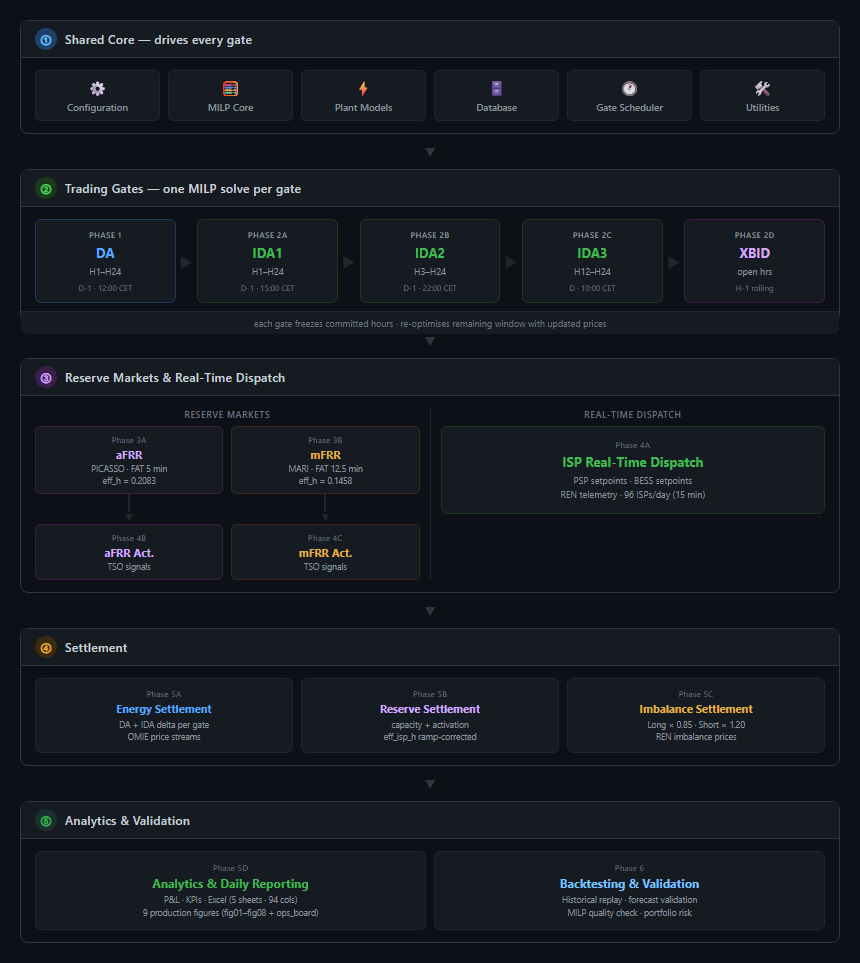

# ⚡ Alqueva PSP + PV + BESS — 24-Hour Energy Trading Optimizer

<p align="center">
  
  
  
  
  
  
</p>

<p align="center">
  <b>Production-grade 24-hour MILP trading optimizer for the Alqueva hybrid energy plant (Portugal / MIBEL)</b><br/>
  Pumped-Storage Hydro &nbsp;·&nbsp; Floating PV &nbsp;·&nbsp; Battery Storage &nbsp;·&nbsp; DA / IDA / XBID / aFRR / mFRR &nbsp;·&nbsp; Full Settlement & Analytics
</p>

<p align="center">
  <code>15 pipeline phases</code> &nbsp;·&nbsp;
  <code>16 entry points</code> &nbsp;·&nbsp;
  <code>9 production figures</code> &nbsp;·&nbsp;
  <code>5-sheet Excel report</code> &nbsp;·&nbsp;
  <code>4 YAML configs</code> &nbsp;·&nbsp;
  <code>1 shared MILP model</code>
</p>

---

## 🗺️ Pipeline Architecture

<p align="center">
  
</p>

<details>
<summary>📐 Mermaid source (click to expand)</summary>
<br/>

```mermaid
flowchart TD
    subgraph C0["① Shared Core — drives every gate"]
        direction LR
        cfg["⚙️ Configuration"] --- milp["🧮 MILP Core"] --- phy["⚡ Plant Models"] --- db["🗄️ Database"] --- sched["🕐 Gate Scheduler"] --- util["🛠️ Utilities"]
    end

    subgraph G0["② Trading Gates — one MILP solve per gate"]
        direction LR
        DA["**Phase 1 · DA**<br/>H1–H24 · D-1 12:00 CET"]
        --> IDA1["**Phase 2A · IDA1**<br/>H1–H24 · D-1 15:00 CET"]
        --> IDA2["**Phase 2B · IDA2**<br/>H3–H24 · D-1 22:00 CET"]
        --> IDA3["**Phase 2C · IDA3**<br/>H12–H24 · D 10:00 CET"]
        --> XBID["**Phase 2D · XBID**<br/>open hours · H-1 rolling"]
    end

    P3A["**Phase 3A · aFRR**<br/>PICASSO · FAT 5 min · eff_h 0.2083"]
    P4B["**Phase 4B · aFRR Activation**<br/>TSO signal · ramp-corrected"]
    P3B["**Phase 3B · mFRR**<br/>MARI · FAT 12.5 min · eff_h 0.1458"]
    P4C["**Phase 4C · mFRR Activation**<br/>TSO signal · ramp-corrected"]
    RT["**Phase 4A · ISP Real-Time Dispatch**<br/>PSP & BESS setpoints · 96 ISPs/day · REN telemetry"]

    subgraph S0["④ Settlement"]
        direction LR
        S5A["**Phase 5A · Energy**<br/>DA + IDA delta · OMIE"] &
        S5B["**Phase 5B · Reserve**<br/>capacity + act · eff_isp_h"] &
        S5C["**Phase 5C · Imbalance**<br/>Long×0.85 · Short×1.20 · REN"]
    end

    subgraph A0["⑤ Analytics & Validation"]
        direction LR
        A5D["**Phase 5D · Analytics**<br/>P&L · KPIs · Excel · 9 figures"] &
        A6["**Phase 6 · Backtesting**<br/>Historical replay · MILP quality · portfolio risk"]
    end

    C0 --> G0
    G0 --> P3A & P3B & RT
    P3A --> P4B
    P3B --> P4C
    P4B & P4C & RT --> S0
    S0 --> A0
```

</details>

---

## 🏭 Plant

| Asset | Specification |
|-------|--------------|
| **PSP — Pumped Storage** | 4 × reversible Francis units · 129.6 MW turbine / 111.6 MW pump each → **518.4 MW generation / 446.4 MW pumping** |
| **PV — Floating Solar** | 5 MWp · commissioned 2022 · temperature derate · annual degradation model |
| **BESS — Battery** | 1 MW / 2 MWh · SOC 10 %–95 % · η_charge = η_discharge = 0.90 |
| **Upper Reservoir** | Alqueva · 3,150 hm³ usable · head range **54.7–73.0 m** |
| **Lower Reservoir** | Pedrógão · 54 hm³ usable · binding constraint on long pumping sequences |

> **Sign convention:** generation / discharge = **+** &nbsp;·&nbsp; pumping / charging = **−**

---

## 📈 Market Coverage

| Gate | Exchange | Gate Close (CET) | Hours in Scope |
|------|----------|-----------------|----------------|
| **Day-Ahead (DA)** | OMIE | D-1 12:00 | H1–H24 · all 24 hours |
| **IDA1** | OMIE SIDC | D-1 15:00 | H1–H24 |
| **IDA2** | OMIE SIDC | D-1 22:00 | H3–H24 |
| **IDA3** | OMIE SIDC | D 10:00 | H12–H24 &nbsp;(H1–H11 frozen) |
| **XBID** | SIDC continuous | H-1 rolling | Open hours only |
| **aFRR** | PICASSO | DA + 1 h | Symmetric ±MW · FAT = 5 min · cap ≤ 250 EUR/MW |
| **mFRR** | MARI | DA + 1 h | Symmetric ±MW · FAT = 12.5 min |
| **Imbalance** | REN | Post-delivery | Long → DA×0.85 · Short → DA×1.20 |

> [!NOTE]
> **Regulatory dates hard-coded in `config/market.yaml`:**
> SIDC 6→3 sessions from **13 Jun 2024** · ISP 15-min (96/day) from **19 Mar 2025** · PICASSO harmonised **4 Dec 2024** · MARI/REN joined **27 Nov 2024** · FCR is mandatory & non-remunerated — modelled as reserved headroom only, never a market gate.

---

## 🚀 Quick Start

```bash
# 1. Install dependencies
pip install -r requirements.txt

# 2. Run full pipeline for tomorrow (AUTO mode, synthetic prices — no CPLEX needed)
python run_production.py

# 3. Run for a specific date
python run_production.py --date 2026-06-28

# 4. Backtest mode — fully automated, no live APIs
python run_production.py --date 2026-06-28 --auto --synthetic

# 5. Resume from a specific phase after a crash
python run_production.py --date 2026-06-28 --from-phase realtime

# 6. Run only selected phases
python run_production.py --date 2026-06-28 --only da,afrr,mfrr

# 7. Validate config and imports without executing anything
python run_production.py --dry-run
```

> [!TIP]
> **No CPLEX licence?** The pipeline auto-selects **HiGHS** (free, bundled via `highspy`) or CBC. Set solver preference in `config/solver.yaml`. Everything works out of the box.

---

## 🧮 MILP Core

> One model drives **every gate.** DA, IDA1, IDA2, IDA3, and XBID all solve the same 24-hour MILP defined in `common_layer/optimisation_model/core_milp_builder.py`. Gates differ only in price inputs and which hours are frozen to the already-committed position. **A constraint fix propagates to every gate automatically.**

### Decision Variables

| Variable | Dimensions | Description |
|----------|-----------|-------------|
| `p_turb[u,h]` / `p_pump[u,h]` | unit × hour | Turbine / pump power (MW, non-negative magnitude) |
| `on_turb[u,h]` / `on_pump[u,h]` | unit × hour | Mode binaries — mutually exclusive (PR-1) |
| `H_net[h]` | hour | Dynamic hydraulic head (m) — linear in reservoir volume |
| `omega_trb[u,fi,hi,h]` / `omega_pmp[u,fi,hi,h]` | unit × flow × head × hour | 5×5 efficiency surface interpolation weights |
| `pv_used[h]` / `pv_to_bess[h]` / `pv_curt[h]` | hour | PV disposition — must sum to PV forecast |
| `p_chg[h]` / `p_dis[h]` / `soc[h]` | hour | BESS charge / discharge / state of charge |
| `v_up[h]` / `v_low[h]` | hour | Upper (Alqueva) / lower (Pedrógão) reservoir volumes (hm³) |
| `p_net[h]` | hour | Net grid injection = bid quantity (MWh) |

### Key Physics Constraints

| Constraint | Formula / Rule |
|-----------|----------------|
| **Head model** | `H_net = 54.7 + 7.89e-9 × (v_up_m³ − 830e6)` m · range 54.7–73.0 m |
| **Efficiency surface** | η = f(flow_norm, head_norm) · 5×5 bilinear · clipped [0.85, 0.92] |
| **McCormick linearisation** | 4 envelope constraints × 2 modes × 4 units × 24 hours for `H_net × on_binary` |
| **Net power identity** | `p_net = PSP_net + pv_used + p_dis − p_chg` (pv_to_bess is internal) |
| **No double-selling (PR-11)** | headroom = capacity − committed `p_net` − FCR reserved |

---

## 📋 Phase Reference

| Phase | Entry Point | What It Does |
|-------|------------|--------------|
| **Phase 1 · DA** | `run_da.py` | MILP solve → physical check → risk check → trader approval → position save |
| **Phase 2A · IDA1** | `run_ida1.py` | Re-optimise H1–H24 · no-churn threshold · SIDC delta bids |
| **Phase 2B · IDA2** | `run_ida2.py` | H1–H2 frozen · re-optimise H3–H24 |
| **Phase 2C · IDA3** | `run_ida3.py` | H1–H11 frozen · re-optimise H12–H24 |
| **Phase 2D · XBID** | `run_xbid.py` | Continuous intraday · per-order caps · H-1 rolling |
| **Phase 3A · aFRR** | `run_afrr.py` | Capacity offers · PICASSO · FAT 5 min · eff_isp_h = 0.2083 h |
| **Phase 3B · mFRR** | `run_mfrr.py` | Capacity offers · MARI · FAT 12.5 min · eff_isp_h = 0.1458 h |
| **Phase 4A · Real-Time** | `run_realtime.py` | 96 ISPs/day · PSP + BESS setpoints · REN telemetry feed |
| **Phase 4B · aFRR Act.** | `run_afrr_activation.py` | TSO activation → ramp-corrected energy · min hold 2 ISPs |
| **Phase 4C · mFRR Act.** | `run_mfrr_activation.py` | TSO activation → ramp-corrected energy · min hold 3 ISPs |
| **Phase 5A · Energy** | `run_energy_settlement.py` | DA + IDA delta per gate · OMIE prices · no double-counting |
| **Phase 5B · Reserve** | `run_reserve_settlement.py` | Capacity (hourly) + activation · eff_isp_h ramp-corrected · PICASSO + MARI |
| **Phase 5C · Imbalance** | `run_imbalance_settlement.py` | Long→DA×0.85 · Short→DA×1.20 · REN imbalance prices |
| **Phase 5D · Analytics** | `run_analytics.py` | Daily P&L · KPIs · 5-sheet Excel report · 9 production figures |
| **Phase 6 · Backtest** | `run_backtest.py` | Historical replay · forecast validation · MILP quality · portfolio risk |

---

## 🏗️ Project Structure

```
Alqueva-PSP-PV-BESS-24hr-Energy-Trading-DA-IDA-aFRR-mFRR-Optimizer/
│
├── run_production.py                          # ◀ Master orchestrator — runs all 15 phases
│
├── common_layer/                              # Shared foundation for every phase
│   ├── configuration/                         # AppConfig · PlantConfig · MarketConfig · SolverConfig
│   ├── optimisation_model/                    # CoreModelMeta · solve_milp() · ida_reoptimiser · reserve builder
│   ├── physical_plant_models/                 # PSPModel · PVModel · BESSModel · ReservoirModel · FCR
│   ├── database/                              # PositionStore · ReserveStore · DeliveryStore · ActivationStore · AuditStore
│   ├── gate_scheduler/                        # GateScheduler — CET gate-time resolver
│   └── utilities/                             # AuditLogger · timezone utils · ISP calendar · logging
│
├── phase_1_da_day_ahead_bidding/              # Phase 1  — DA
├── phase_2a_ida1_intraday_auction_1/          # Phase 2A — IDA1
├── phase_2b_ida2_intraday_auction_2/          # Phase 2B — IDA2
├── phase_2c_ida3_intraday_auction_3/          # Phase 2C — IDA3
├── phase_2d_xbid_continuous_intraday/         # Phase 2D — XBID
├── phase_3a_afrr_automatic_frequency_reserve/ # Phase 3A — aFRR capacity offers
├── phase_3b_mfrr_manual_frequency_reserve/    # Phase 3B — mFRR capacity offers
├── phase_4a_isp_real_time_dispatch/           # Phase 4A — ISP real-time dispatch
├── phase_4b_afrr_activation_response/         # Phase 4B — aFRR activation
├── phase_4c_mfrr_activation_response/         # Phase 4C — mFRR activation
├── phase_5a_da_ida_settlement/                # Phase 5A — Energy settlement
├── phase_5b_reserve_settlement/               # Phase 5B — Reserve settlement
├── phase_5c_imbalance_settlement/             # Phase 5C — Imbalance settlement
├── phase_5d_analytics_and_reporting/          # Phase 5D — P&L · KPIs · Excel · figures
├── phase_6_backtesting_and_validation/        # Phase 6  — Backtesting & validation
│
├── figures/                                   # 9 Matplotlib figure generators (600 DPI)
├── config/                                    # market.yaml · plant.yaml · solver.yaml · run.yaml
├── tests/                                     # pytest — e2e · physics · settlement · reserve
├── runtime/                                   # Auto-created at first run
│   ├── db/                                    #   positions.db · reserve.db · realtime.db (SQLite)
│   ├── audit/                                 #   audit_YYYY-MM-DD.jsonl (append-only)
│   ├── components/                            #   components_YYYY-MM-DD.json (per-component dispatch)
│   └── reports/                              #   daily_report_YYYY-MM-DD.xlsx
└── docs/                                      # Pipeline architecture PNG + SVG
```

---

## 📊 Outputs

### 9 Production Figures — `figures/output/` · 600 DPI

| # | Filename | Description |
|---|----------|-------------|
| 1 | `fig01_dispatch_profile.png` | DA net position (MWh) + DA price (EUR/MWh) — bar + line overlay |
| 2 | `fig02_soc_trajectory.png` | BESS state of charge (% of 2 MWh) · 10 %/95 % bounds · step plot |
| 3 | `fig03_revenue_waterfall.png` | Revenue by stream — DA · IDA+XBID · aFRR · mFRR · Imbalance — stacked bar |
| 4 | `fig04_reserve_capacity.png` | aFRR + mFRR capacity offered (MW up/dn per hour) · dual subplots |
| 5 | `fig05_gate_position_comparison.png` | Position evolution DA → IDA1 → IDA2 → IDA3 → XBID — line plot |
| 6 | `fig06_intraday_reoptimisation.png` | DA vs final committed position · IDA+XBID delta bar overlay |
| 7 | `fig07_psp_dispatch.png` | PSP turbine / pump MW schedule vs DA price — bar + line |
| 8 | `fig08_pv_bess_flow.png` | PV disposition (used / to-BESS / curtailed) + BESS power — dual subplots |
| 9 | `ops_board.png` | 3×3 operations dashboard — dispatch · SoC · KPIs · positions · aFRR · mFRR · P&L |

### 5-Sheet Excel Report — `runtime/reports/daily_report_<date>.xlsx`

| Sheet | Cols | Contents |
|-------|------|----------|
| **Dispatch_Hourly** | 94 | Hour-by-hour schedule — PSP units · BESS · PV · reservoir · head · all gate positions |
| **ISP_Activation** | — | Per-ISP (15 min) aFRR / mFRR activated MW with ramp-corrected energy |
| **Gate_Decisions** | — | DA → IDA1 → IDA2 → IDA3 → XBID position evolution and P&L per gate |
| **Summary_KPIs** | — | 10 KPI sections — revenue · dispatch · reserves · imbalance · solver quality · risk |
| **Glossary** | — | Variable definitions, units, and specification cross-references |

---

## 🗄️ Shared Core — `common_layer/`

<details>
<summary>Optimisation model modules</summary>

| Module | Class / Function | Role |
|--------|-----------------|------|
| `core_milp_builder.py` | `CoreModelMeta` · `build_milp()` | Shared 24h MILP — one model for all gates |
| `core_milp_solver.py` | `solve_milp()` · `SolveError` | CPLEX-first auto-select · raises `SolveError` if infeasible (PR-13) |
| `ida_reoptimiser.py` | `optimise_ida()` | Freeze committed hours · re-solve with updated prices |
| `reserve_offer_builder.py` | `build_afrr_offers()` · `build_mfrr_offers()` | Headroom after committed energy — no double-selling (PR-11) |
| `activation_ramp_tracker.py` | — | Ramp-corrected effective ISP hours for reserve settlement |

</details>

<details>
<summary>Physical plant model classes</summary>

| Module | Class | Role |
|--------|-------|------|
| `psp_turbine_pump_model.py` | `PSPModel` · `UnitDispatch` | 4 Francis units · mode exclusivity (PR-1) · min stable load (PR-2) |
| `pv_production_model.py` | `PVModel` | 5 MWp PV · temperature derate · annual degradation |
| `bess_model.py` | `BESSModel` · `BESSDispatch` | SOC bounds (PR-7) · no simultaneous charge/discharge (PR-8) · FAT deliverability |
| `reservoir_model.py` | `ReservoirModel` | Two-reservoir closed-loop water balance · spill · volume bounds |
| `fcr_headroom_model.py` | `FCRHeadroomModel` | FCR headroom reserved — never sold to any market |
| `reservoir_activation_checker.py` | `ReservoirActivationChecker` | Validates pumping sequences against lower reservoir bounds |

</details>

<details>
<summary>Database stores and runtime files</summary>

| Class | Storage | Description |
|-------|---------|-------------|
| `PositionStore` | `runtime/db/positions.db` | Committed energy positions per gate (FR-1.4 / INV-8) |
| `ReserveStore` | `runtime/db/reserve.db` | aFRR / mFRR capacity offers |
| `DeliveryStore` | `runtime/db/realtime.db` | Per-ISP scheduled vs actual net power |
| `ActivationStore` | `runtime/db/realtime.db` | Per-ISP aFRR / mFRR activated energy (up / dn MW) |
| `ComponentStore` | `runtime/components/<date>.json` | Per-component DA dispatch — PSP · BESS · PV · reservoir |
| `AuditStore` | `runtime/audit/audit_<date>.jsonl` | Read-only query of append-only audit trail |

</details>

<details>
<summary>Configuration files — config/</summary>

| File | Controls |
|------|---------|
| `config/market.yaml` | Gate times · IDA regime dates · ISP duration · FAT values · bid price limits |
| `config/plant.yaml` | PSP / PV / BESS / reservoir specs · head model · efficiency surface · timezone |
| `config/solver.yaml` | Solver order (CPLEX → HiGHS → CBC) · MIP gap · per-gate time limits · threads |
| `config/run.yaml` | Delivery date · mode (trader / auto) · data source (synthetic / live) · phase flags |

Loaded via `config_loader.py` → `AppConfig` (aggregates `PlantConfig` · `MarketConfig` · `SolverConfig`).

</details>

---

## 📦 Dependencies

| Package | Version | Purpose |
|---------|---------|---------|
| `pyomo` | ≥ 6.7 | Optimisation modelling layer (solver-agnostic) |
| `highspy` | ≥ 1.7 | HiGHS MILP solver — free fallback when CPLEX absent |
| `numpy` | ≥ 1.26 | Numerics |
| `pandas` | ≥ 2.2 | Data handling |
| `PyYAML` | ≥ 6.0 | Config file loading |
| `openpyxl` | ≥ 3.1 | Excel report export |
| `requests` | ≥ 2.31 | Live OMIE / REN data loaders (live mode only) |
| **stdlib** | — | `sqlite3` · `zoneinfo` · `dataclasses` · `datetime` · `json` · `pathlib` |

> [!NOTE]
> **CPLEX setup:** CPLEX 22.1 is invoked as an external executable via Pyomo — no Python binding needed. Install IBM CPLEX separately and set the path in `config/solver.yaml`. Without CPLEX the pipeline silently falls back to HiGHS with no configuration required.

---

## ✅ Design Principles

| Principle | Implementation |
|-----------|----------------|
| **One MILP, all gates** | `core_milp_builder.py` owns all physics; gates change only price inputs and frozen-hour mask |
| **No double-selling** | `reserve_offer_builder.py` subtracts committed `p_net` before computing headroom (PR-11) |
| **Audit trail on every action** | `AuditLogger` writes one JSONL record per solve / position save / approval / submission |
| **Physical validation first** | Each phase runs a checker (mode exclusivity · SOC · reservoir · FAT) before any market call |
| **Timezone-correct** | Gate times in CET (Madrid) · plant timestamps in WET/CET (Lisbon) · DST handled automatically |
| **Solver resilience** | CPLEX → HiGHS → CBC fallback · `SolveError` raised if no feasible solution within time limit |
| **Fully restartable** | `--from-phase` resumes any run from any phase without re-running earlier phases |
